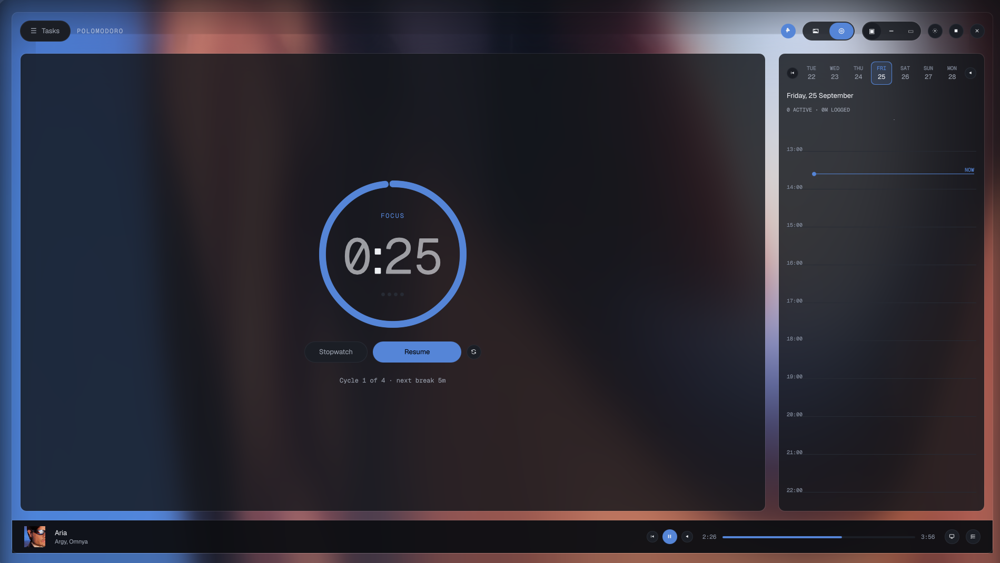
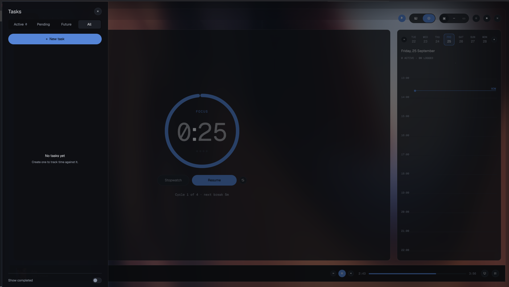

# Polomodoro

Linux desktop Pomodoro + stopwatch app with nested task tracking, SQLite persistence, MPRIS-based Spotify control, and three view modes (expanded, progress bar, PiP).






*Top to bottom: expanded view (the accent colour is derived from the current wallpaper or album art), the task drawer, and progress-bar mode.*

## Dependencies (Arch/CachyOS)

```bash
sudo pacman -S qt6-base qt6-declarative cmake ninja gcc spotifyd qtkeychain-qt6
```

`spotifyd` is the local Spotify Connect target. Polomodoro launches its own
child (cache under `~/.config/polomodoro/spotifyd`, device name "Polomodoro").
That process cannot play until it has **its own** librespot login — Settings →
Music → **Sign in to spotifyd**. That is a different login from the Web API
playlist/search account. Auto-launch can be turned off in Settings → Music if
you'd rather run your own `spotifyd`.
`qtkeychain-qt6` is optional but recommended: without it, signing in to
Spotify's Web API does not survive a restart (the refresh token is kept in
memory only, deliberately never written to the settings database).

## Build

```bash
cd ~/Projects/polomodoro
cmake -B build -G Ninja -DCMAKE_BUILD_TYPE=Release
cmake --build build
./build/polomodoro
```

Optional static C++ runtime:

```bash
cmake -B build -G Ninja -DCMAKE_BUILD_TYPE=Release -DPOLOMODORO_STATIC_STDCXX=ON
```

## Features

- **Pomodoro** and **stopwatch** timers
- **Nested tasks** with start/pause/resume/stop lifecycle
- **Multiple active tasks** at once; active time survives reboot (SQLite + heartbeat)
- **Scheduling**: start date, end date, target duration per task
- **Task menu** (☰): Active / Pending / Future / All tabs
- **Three view modes**: Expanded, Progress Bar (with subtask dropdown + compact transport), PiP
- **Backgrounds**: wallpaper rotation or Spotify album art (from `mpris:artUrl`)
- **Spotify via MPRIS + Web API**: transport (play/pause/next/previous/seek) works against whatever MPRIS player is on the session bus, no account needed; playlists, search and device switching need a one-time Spotify sign-in (OAuth PKCE)

## Setting up Spotify

Two separate logins. One without the other looks like "Spotify is connected
but play 404s / nothing uses spotifyd."

**A. spotifyd (this machine actually plays audio)**

1. Settings → Music → **Sign in to spotifyd**. A browser window opens
   (`spotifyd authenticate`, redirect on `127.0.0.1:8890`).
2. Approve. Credentials are stored under `~/.config/polomodoro/spotifyd`.
3. Polomodoro restarts the daemon; "Polomodoro" should then show up as a
   Connect device and MPRIS player once something is playing.

**B. Web API (playlists, search, "play this URI on a device")**

1. Register an app at [developer.spotify.com](https://developer.spotify.com/dashboard). Add `http://127.0.0.1:8888/callback` as a redirect URI.
2. Copy the **Client ID** into Settings → Music → Client ID. No client secret — PKCE.
3. Click **Sign in** in Settings or the Music library overlay (`Ctrl+M`).

Play always targets the local "Polomodoro" device, not whatever phone or web
player Spotify last marked active (those stale IDs are what produced HTTP 404).

## Installing and verifying releases

Release packages are built and signed by CI (Arch/CachyOS, x86_64). Each
[GitHub Release](https://github.com/Charudatta999/polomodoro/releases)
contains:

| File | What it is |
|---|---|
| `polomodoro-<ver>-x86_64.pkg.tar.zst` (+ `.sig`) | the package and its detached signature |
| `polomodoro-debug-<ver>-x86_64.pkg.tar.zst` (+ `.sig`) | debug symbols, optional |
| `SHA256SUMS` (+ `.asc`) | checksums, signed |
| `polomodoro-signing-key.asc` | the public signing key |

Tags with a suffix such as `v0.1.0-beta.1` are published as **pre-releases**.
Package versions use `_` instead of `-` (`0.1.0_beta.1`) because pacman forbids
hyphens in versions.

Signing key fingerprint — check it before trusting anything:

```
9E01 8D0C AFA7 F62F 6E98  7061 84E6 68F7 4B97 C45F
```

```bash
# 1. Download the release (private repo: needs `gh auth login`; use --pattern to limit)
gh release download v0.1.0-beta.1 --repo Charudatta999/polomodoro

# 2. Import the key and confirm the fingerprint above matches
gpg --import polomodoro-signing-key.asc
gpg --fingerprint "Polomodoro CI"

# 3. Verify signatures and checksums
gpg --verify polomodoro-0.1.0_beta.1-1-x86_64.pkg.tar.zst.sig \
             polomodoro-0.1.0_beta.1-1-x86_64.pkg.tar.zst
gpg --verify SHA256SUMS.asc SHA256SUMS
sha256sum -c SHA256SUMS

# 4. Let pacman trust the key. pacman keeps its OWN keyring, so `gpg --import`
#    above does not count; without this, `pacman -U` fails with
#    "required key missing from keyring".
sudo pacman-key --add polomodoro-signing-key.asc
sudo pacman-key --lsign-key 9E018D0CAFA7F62F6E98706184E668F74B97C45F

# 5. Install (the main package only; the glob skips the -debug package)
sudo pacman -U polomodoro-[0-9]*.pkg.tar.zst
```

Only run step 4 after you have confirmed the fingerprint in step 2.

The key expires 2028-09-24; releases signed after that will show an expired
key until it is extended.

To build the package yourself instead: `packaging/make-source-tarball.sh <version>`,
then `cd packaging/arch && POLOMODORO_PKGVER=<version> makepkg -si`.

## Data

Database: `~/.config/polomodoro/polomodoro.db`

Backup: `cp ~/.config/polomodoro/polomodoro.db ~/.config/polomodoro/polomodoro.db.bak`

The Spotify refresh token is **not** in this database — it lives in the
system keyring (via qtkeychain) so the database stays copyable as a plain
backup. Copying the database elsewhere does not leak Spotify access.

## Keyboard shortcuts

| Shortcut | Action |
|----------|--------|
| `Ctrl+Shift+E` | Open task menu |
| `Ctrl+Shift+1/2/3` | Expanded / Bar / PiP |
| `Ctrl+Shift+T` | Toggle always on top |
| `Ctrl+Shift+B` | Cycle background source |
| `Ctrl+M` | Toggle Music library overlay |

## Notes

- Qt WebEngine was removed (2026-09-17) along with the embedded Spotify web
  player — see `PROGRESS.md` for why. Playback is spotifyd/MPRIS, browsing is
  the Spotify Web API.
- MPRIS player selection: if more than one player is on the bus, Polomodoro
  prefers one whose service name contains "spotify"; otherwise it follows
  whichever one appeared first, and switches if a spotify-named one appears
  later.
- `SpotifydManager` never launches a second `spotifyd` if one whose MPRIS
  service name contains "spotify" is already on the bus (checked once at
  startup) — it won't collide with an instance you're already running
  yourself. It always passes `--no-daemon` so the child stays attached to
  Polomodoro's own process tree and gets terminated (not orphaned) on exit.
